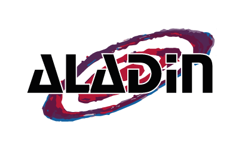

# Aladin Lite
**An astronomical HiPS visualizer in the browser** 

Aladin Lite is a Web application which enables HiPS visualization from the browser. It is developed at [CDS, Strasbourg astronomical data center](http://cds.unistra.fr/).

See [A&A 578, A114 (2015)](https://arxiv.org/abs/1505.02291) and [IVOA HiPS Recommendation](http://ivoa.net/documents/HiPS/index.html) for more details about the HiPS standard.

Aladin Lite is built to be easily embeddable in any web page. It powers astronomical portals like [ESASky](https://almascience.eso.org/asax/), [ESO Science Archive portal](http://archive.eso.org/scienceportal/) and [ALMA Portal](https://almascience.eso.org/asax/).

More details on [Aladin Lite documentation page](http://aladin.u-strasbg.fr/AladinLite/doc/).

## Source code

Source code is available in the ``src`` directory.

## Licence

Aladin Lite is currently licensed under GPL v3.0

If you think this license might prevent you from using Aladin Lite in your pages/application/portal, please open an issue or [contact us](mailto:cds-question@unistra.fr)

## Building the application

1. Clone the repository
2. Go to the ``scripts``directory
3. Open the `build.sh` file and adapt paths to ``uglifyjs`` and ``lessc``
4. Launch ``./build.sh``
5. Go to directory ``../distrib/latest/`` , type ``python3 -m http.server 42195`` and open your browser at [http://0.0.0.0:42195/](http://0.0.0.0:42195/) to launch the built application

## Contributing

There are several ways to contribute to Aladin Lite:

- **report a bug**: anyone is welcome to open an issue to report a bug. Please make sure first the issue does not exist yet. Be as specific as possible, and provide if possible detailed instructions about how to reproduce the problem.

- **suggest a new feature**: if you feel something is missing, check first if a similar feature request has not already been submitted in the open issues. If not, open a new issue, and give a detailed explanation of the feature you wish.

- **develop new features/provide code fixing bugs**. As open development is a new thing for us, we will in a first time only take into consideration code contribution (_i.e._ Pull Requests) from our close partners.
In any case, please get in touch before starting a major update or rewrite.
